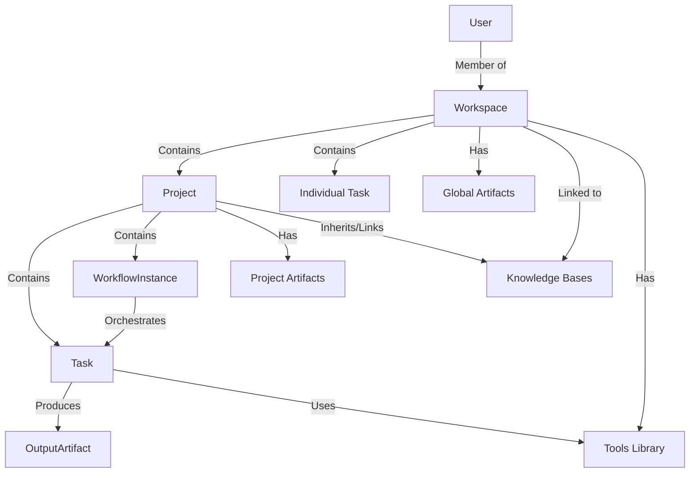

# Expansion Design Specification: LumiKB Work OS

## 1. Core Hierarchy & Entity Model

Based on the requirement for distinct functional areas (Sales, AML, Support), we introduce a **Workspace-first** hierarchy.

### The Hierarchy


### Entity Definitions

#### 1. Workspace (The "Department")
*   **Concept**: A high-level container for a specific domain (e.g., "Sales Team", "AML Compliance").
*   **Storage**: `workspaces` table.
*   **Key Attributes**: `name`, `domain_type`, `settings` (default agents, templates).
*   **Context**: Links to specific Knowledge Bases (e.g., Sales Workspace links to "Product Docs" and "Pricing" KBs).

#### 2. Project (The "Case")
*   **Concept**: A specific goal or case (e.g., "Acme Corp RFP", "Q3 AML Audit").
*   **Storage**: `projects` table.
*   **Key Attributes**: `workspace_id`, `status`, `deadline`.
*   **Context**: Can override Workspace settings or add specific KBs (e.g., "Acme Corp Specs" uploaded just for this project).

#### 3. Artifact (The "File")
*   **Concept**: Any file or document managed by the system.
*   **Storage**: `artifacts` table + MinIO object storage.
*   **Types**:
    *   **Source**: Uploaded by user (PDF, DOCX).
    *   **Generated**: Created by Agent/Task (Draft, Report).
*   **Scope**: Can belong to Workspace (global templates), Project (case files), or Task (outputs).

#### 4. Task (The "Unit of Work")
*   **Concept**: A single executable unit.
*   **Storage**: `tasks` table.
*   **Types**:
    *   **Simple**: "Create BRD Questionnaire".
    *   **Workflow Node**: A step within a larger workflow.
*   **Execution**: Assigned to **Agent** (AI) or **User** (Human).

#### 5. Workflow (The "Process")
*   **Concept**: A template for a multi-step process (e.g., "RFP Response Flow").
*   **Definition**: Stored as a JSON graph (Nodes = Tasks, Edges = Dependencies).
*   **Instance**: A running copy of a workflow for a specific Project.

#### 6. Tool (The "Capability")
*   **Concept**: A specific function or capability that can be invoked.
*   **Storage**: `tools` table (for definitions) + Code Registry.
*   **Types**:
    *   **Code Tool**: Python function (Backend) or TypeScript (via MCP/Sandbox). E.g., `calculate_risk_score()`, `fetch_stock_price()`.
    *   **AI Tool**: A prompt chain wrapping an LLM capability. E.g., `summarize_document()`, `extract_entities()`.
    *   **Database Tool**: A specialized connector to query external SQL/NoSQL databases. E.g., `query_incident_db(sql)`, `fetch_customer_profile(id)`.
*   **Usage**: Can be attached to Agents, used in Workflow steps, or invoked directly in Chat.

---

## 2. Management & Loading Strategy

How do we define, store, and load these dynamic components?

### A. Agents (Personas)
*   **Definition**:
    *   **System Agents**: Hardcoded in Python (Base capabilities).
    *   **Custom Agents**: Stored in DB (`agents` table). Defined by: `Name`, `Role`, `System Prompt`, `Tools` (list of tool IDs).
*   **Loading**:
    *   `AgentRegistry` loads System Agents at startup.
    *   When a Task starts, `AgentLoader` fetches the specific Agent config from DB (if custom) or Registry (if system).
    *   **Context Injection**: The Agent's prompt is dynamically injected with Workspace/Project context (e.g., "You are an AML expert working on the Q3 Audit project...").

### B. Commands & Templates
*   **Commands**:
    *   **Registry**: A map of `/command` -> `HandlerFunction` or `WorkflowID`.
    *   **Scoped**: Some commands only exist in specific Workspaces (e.g., `/aml-check` only in AML Workspace).
*   **Templates**:
    *   **Storage**: `templates` table.
    *   **Scope**: Workspace-specific. A "Sales" workspace sees "RFP Template", "AML" sees "Audit Checklist".

### C. Workflows (Definition & Execution)
*   **Definition (Design Time)**:
    *   **UI**: A React Flow based builder. Users drag "Task Nodes" and connect them.
    *   **Storage**: JSON blob in `workflow_definitions` table.
*   **Execution (Runtime)**:
    *   **Engine**: We use **LangGraph** (or a custom DAG runner on Celery).
    *   **State**: `workflow_instances` table tracks current step, inputs, outputs, and status.
    *   **Parallelism**: The engine detects nodes with satisfied dependencies and schedules them on Celery workers simultaneously.

### D. Tools (Registry & Execution)
*   **Registry**:
    *   **Python Tools**: Decorated functions `@tool` registered at startup.
    *   **MCP Tools**: Connect to external MCP servers (Model Context Protocol) to consume tools from other services/languages.
*   **Execution**:
    *   **In Chat**: User invokes via slash command or natural language.
    *   **In Agent**: Agent LLM decides to call tool -> System executes -> Result fed back to LLM.
    *   **In Workflow**: Explicit "Tool Step" in the graph.

---

## 3. Chat as Command Center

The Chat interface becomes the unified entry point for all execution.

### Interaction Models

1.  **Direct Execution (Slash Commands)**
    *   `/agent @Researcher "Find competitors"` -> Spawns Agent Task.
    *   `/workflow "AML Audit" --project="Q3 Audit"` -> Triggers Workflow.
    *   `/tool run risk_calculator --amount=5000` -> Runs specific tool.

2.  **Natural Language Intent (The "Router")**
    *   User: "I need to check the AML compliance for transaction TX-123."
    *   **Router (LLM)**: Detects intent -> Maps to `AML Check Workflow` or `Compliance Agent`.
    *   System: "I can run the **AML Check Workflow** for TX-123. Proceed?"

3.  **Contextual Loading**
    *   User: "@Researcher, use the 'Web Search' tool to find..."
    *   System: Dynamically loads 'Web Search' tool into the @Researcher agent's context for this turn.

---

## 4. Use Case: Internal Audit (Hybrid Search)

This scenario demonstrates the power of combining **Knowledge Base (Unstructured)** with **Database Tools (Structured)**.

### Setup
*   **Workspace**: "Internal Audit"
*   **KB**: "Audit Reports 2020-2024" (PDFs of past findings).
*   **Tool**: `incident_db_tool` (Connects to PostgreSQL `incidents` table).
*   **Agent**: "Audit Assistant" (Has access to both KB and Tool).

### Workflow
1.  **User Query**: "Analyze the risk of 'Data Leakage' incidents in Q3 and compare with past audit findings."
2.  **Agent Execution**:
    *   **Step 1 (Tool Call)**: Agent calls `incident_db_tool.query("SELECT * FROM incidents WHERE type='Data Leakage' AND date >= '2024-07-01'")`.
        *   *Result*: "Found 5 incidents in Q3."
    *   **Step 2 (KB Search)**: Agent searches KB for "Data Leakage audit findings".
        *   *Result*: "2022 Audit found lack of encryption..."
    *   **Step 3 (Synthesis)**: Agent combines structured data (5 recent incidents) with unstructured context (past findings) to generate an insight.
3.  **Final Output**: "In Q3, we had 5 data leakage incidents. This correlates with the 2022 Audit finding regarding encryption, suggesting the remediation was ineffective."

---

## 5. Data Storage Schema (Draft)

```sql
-- Hierarchy
CREATE TABLE workspaces (
    id UUID PRIMARY KEY,
    name VARCHAR,
    domain_config JSONB -- Default KBs, settings
);

CREATE TABLE projects (
    id UUID PRIMARY KEY,
    workspace_id UUID REFERENCES workspaces,
    name VARCHAR,
    status VARCHAR
);

-- Assets
CREATE TABLE artifacts (
    id UUID PRIMARY KEY,
    workspace_id UUID REFERENCES workspaces, -- Optional (Global/Workspace level)
    project_id UUID REFERENCES projects,     -- Optional (Project level)
    task_id UUID,                            -- Optional (Output of task)
    name VARCHAR,
    minio_path VARCHAR,
    type VARCHAR -- 'source', 'generated'
);

-- Execution
CREATE TABLE tools (
    id UUID PRIMARY KEY,
    workspace_id UUID,
    name VARCHAR,
    type VARCHAR, -- 'PYTHON', 'MCP', 'AI_PROMPT', 'DATABASE'
    config JSONB -- Connection string, schema info, or code path
);

CREATE TABLE agents (
    id UUID PRIMARY KEY,
    workspace_id UUID, -- Custom agents per workspace
    name VARCHAR,
    system_prompt TEXT,
    tools JSONB -- List of tool_ids
);

CREATE TABLE workflow_definitions (
    id UUID PRIMARY KEY,
    workspace_id UUID,
    name VARCHAR,
    definition JSONB -- The Graph
);

CREATE TABLE tasks (
    id UUID PRIMARY KEY,
    project_id UUID REFERENCES projects,
    workflow_instance_id UUID, -- If part of a workflow
    title VARCHAR,
    status VARCHAR, -- PENDING, RUNNING, COMPLETED, FAILED
    assignee_type VARCHAR, -- 'AGENT', 'USER'
    assignee_id UUID, -- Agent ID or User ID
    input_context JSONB,
    output_artifact_id UUID REFERENCES artifacts
);
```

---

## 6. Module: Creative Intelligence Suite (CIS)

Based on the `@[.bmad/cis]` reference, we will integrate a dedicated **Innovation Module**.

### Core Components
1.  **Workspace Type**: "Innovation Lab"
    *   Optimized for divergent thinking and strategy.
    *   Default Agents: Carson, Maya, Victor, Dr. Quinn, Sophia.
2.  **Agents (Facilitators)**:
    *   **Carson (Brainstorming)**: Energetic, uses lateral thinking techniques.
    *   **Maya (Design Thinking)**: Empathic, guides through 5-phase process.
    *   **Dr. Quinn (Problem Solving)**: Analytical, uses Root Cause Analysis (5 Whys).
    *   **Victor (Innovation)**: Strategic, uses Blue Ocean & Disruption patterns.
    *   **Sophia (Storytelling)**: Narrative expert, uses Hero's Journey.
3.  **Workflows**:
    *   **Brainstorming Flow**: Divergent Ideation -> Clustering -> Convergent Selection.
    *   **Design Thinking Flow**: Empathize -> Define -> Ideate -> Prototype -> Test.
    *   **Strategic Storytelling**: Context -> Hero -> Conflict -> Resolution.

### Integration
*   **Chat Mode**: User can invoke `@Carson` for a quick brainstorming session.
*   **Project Mode**: A "New Product Launch" project can use the **Design Thinking Workflow** to structure the entire lifecycle.
*   **Artifacts**: CIS workflows produce structured outputs like "Ideation Matrix", "User Journey Map", "Story Arc".

---

## 7. Module: Quality Assurance (Quality Gates)

To ensure high standards for critical outputs (e.g., Audit Reports, RFP Responses), we introduce **Quality Gates**.

### Core Concepts
1.  **Quality Gate**: A named set of criteria (Checklist) that an artifact must satisfy.
    *   *Example*: "RFP Compliance Check" -> ["Must mention ISO 27001", "Must address all 50 requirements", "No spelling errors"].
2.  **Evaluation Mode**:
    *   **Auto-Eval (AI)**: An "Evaluator Agent" reads the artifact and scores it against the checklist.
    *   **Manual-Eval (Human)**: A user must manually check off items to approve.
3.  **Enforcement**:
    *   **Task Level**: Task cannot be marked "Done" until the output artifact passes the gate.
    *   **Workflow Level**: Workflow pauses at the gate node; if failed, it loops back to the drafting step with feedback.

### Data Model
```sql
CREATE TABLE quality_gates (
    id UUID PRIMARY KEY,
    workspace_id UUID,
    name VARCHAR,
    checklist JSONB, -- List of criteria strings
    mode VARCHAR -- 'AUTO', 'MANUAL'
);

CREATE TABLE quality_checks (
    id UUID PRIMARY KEY,
    artifact_id UUID,
    gate_id UUID,
    status VARCHAR, -- 'PASS', 'FAIL'
    feedback JSONB, -- Detailed results per criteria
    evaluator_id UUID -- Agent or User
);
```

### Execution Flow
1.  **Drafting**: Agent generates `RFP_Response.docx`.
2.  **Trigger**: System detects linked "RFP Quality Gate".
3.  **Check**: "Evaluator Agent" reads document + checklist.
4.  **Result**:
    *   *Pass*: Workflow proceeds to "Final Review".
    *   *Fail*: Workflow loops back to "Drafting Agent" with specific feedback ("Missing ISO 27001 section").
