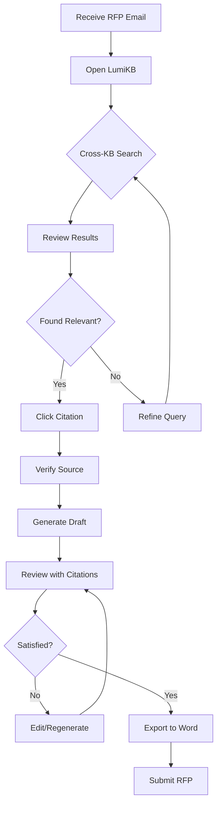
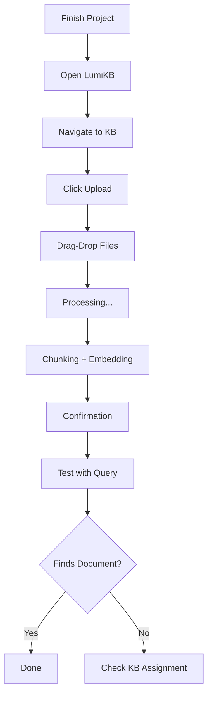
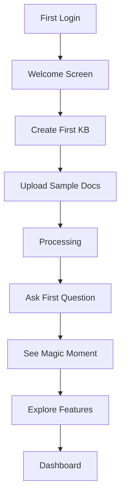

# LumiKB UX Design Specification

_Created on 2025-11-22 by Tung Vu_
_Generated using BMad Method - Create UX Design Workflow v1.0_

---

## Executive Summary

**LumiKB** is an enterprise RAG-powered knowledge management platform that transforms how technical and business teams access, synthesize, and create knowledge artifacts. The platform addresses a fundamental enterprise problem: **organizational knowledge is fragmented, inaccessible, and walks out the door when people leave.**

### Vision
Knowledge that never walks out the door - an AI-powered platform following the **MATCH → MERGE → MAKE** pattern:
- **MATCH**: Intelligent semantic retrieval finds relevant past knowledge
- **MERGE**: Synthesizes knowledge with current context and requirements
- **MAKE**: Assists in creating new artifacts (proposals, documents, solutions) with citations

### Target Users

| Role | Pain Point | Magic Moment |
|------|-----------|--------------|
| **Sales** | RFP responses are slow and inconsistent | "It drafted 80% of my response in minutes!" |
| **Pre-sales** | Missing winning patterns and differentiators | "It found exactly how we solved this before" |
| **Business Consultant** | Gap analysis misses requirements; BRD creation is tedious | "Generated a checklist I would've missed items on" |
| **System Engineer** | TSD creation is time-consuming | "Drafted sections with references to past implementations" |

### User Empathy Profiles

#### Sarah - Sales Rep (Urgent Mode)

*Receives an RFP at 3:47 PM. Deadline is tomorrow morning.*

| Dimension | Insights |
|-----------|----------|
| **THINKS** | "I KNOW we did something like this before..." / "Who worked on the Acme Bank deal?" / "I don't have time to recreate this from scratch" |
| **FEELS** | Pressure, urgency, frustration at scattered knowledge / Anxious about quality under time pressure / Hopeful when she finds something relevant |
| **PAINS** | Time wasted searching / Never sure if she found the BEST past example / Quality varies based on what she happens to find |
| **GAINS** | Winning the deal / Looking competent to leadership / Going home on time |

**UX Needs:** Speed is everything, confidence in results, context showing WHY results are relevant, citations as safety net

#### David - System Engineer (Methodical Mode)

*Writing a Technical Solution Document for a new client implementation.*

| Dimension | Insights |
|-----------|----------|
| **THINKS** | "How did we handle authentication for the last banking client?" / "I don't want to reinvent the wheel" / "There must be a pattern we've used before" |
| **FEELS** | Methodical, wants to do things properly / Frustrated when he can't find past implementations / Proud when he delivers solid technical work |
| **PAINS** | Reinventing solutions that already exist / Inconsistency across projects / Knowledge locked in people's heads |
| **GAINS** | Delivering technically excellent work / Learning from past implementations / Contributing knowledge for others |

**UX Needs:** Depth over speed, technical precision, ability to compare multiple approaches, easy contribution path

### Desired Emotional Response

**Empowered + Delighted** - expressed differently by user type:

- **Sarah (Sales, urgent):** "I have superpowers now - I found exactly what I needed in seconds, not hours"
- **David (Engineer, methodical):** "This is surprisingly smart - it understood what I actually needed and showed me patterns I didn't know existed"

**Trust Pillars:**
- Every answer shows its sources (citations)
- Relevance is explained, not just asserted
- Users can verify in one click
- The system admits when it's uncertain

### Synthesized UX Insights

| Insight | UX Design Implication |
|---------|----------------------|
| **Two modes: Urgent vs. Methodical** | Support both quick answers AND deep exploration |
| **Trust is earned through transparency** | Citations aren't optional - they're THE feature |
| **"Best available" anxiety** | Show confidence indicators, relevance scores |
| **Tribal knowledge problem** | Make contributing as easy as consuming |
| **Context collapse** | Always show WHY a result is relevant to their query |
| **Time pressure is real** | First useful result must appear in <3 seconds |
| **Pride in quality** | Help them produce BETTER work, not just faster work |

### Primary User Journey: RFP Response Flow

**Scenario:** Sarah receives an RFP from a banking client at 3:47 PM. Deadline is 9 AM tomorrow.

| Stage | User Action | Touchpoint | User Feels | Pain Points | Delight Opportunities |
|-------|-------------|------------|------------|-------------|----------------------|
| **1. TRIGGER** | Receives RFP email | Email → LumiKB link | 😰 Stressed | Knows knowledge exists, can't find it | Quick entry from email |
| **2. ORIENT** | Opens LumiKB, selects KB | Dashboard / KB selector | 🤔 Focused | Too many KBs? Which one? | Smart KB suggestions based on content |
| **3. SEARCH** | Types question or pastes RFP section | Chat input / Search bar | 🔍 Curious | Query syntax? Natural language? | Natural language, instant results |
| **4. DISCOVER** | Reviews results, clicks citations | Results + Citation sidebar | 😮 Surprised | Results relevance unclear | "Found Acme proposal I forgot about!" |
| **5. GENERATE** | Requests draft generation | "Generate Draft" button | 🤞 Hopeful | Will it understand context? | "80% draft done in 30 seconds" |
| **6. VERIFY** | Reviews draft, checks sources | Draft viewer + source panel | 🧐 Scrutinizing | Hard to verify claims | One-click source verification |
| **7. EXPORT** | Exports to Word/PDF | Export dialog | 😌 Relieved | Format compatibility | Perfect formatting preserved |

#### Critical Moments (Risk Assessment)

| Moment | Risk Level | Priority | Design Implication |
|--------|------------|----------|-------------------|
| **First search result** | 🔴 HIGH | #1 | If first results aren't relevant, trust is broken |
| **Citation click** | 🔴 HIGH | #2 | Must be instant, show exact passage, not entire doc |
| **Draft generation** | 🟡 MEDIUM | #3 | Set expectations, show progress, stream results |
| **KB selection** | 🟡 MEDIUM | #4 | Smart suggestions, recent history, cross-KB search |
| **Export** | 🟢 LOW | #5 | Preserve formatting and citations |

#### Emotional Journey Curve

The emotional peak should happen at **DISCOVER** ("It found the thing I forgot existed!") and **GENERATE** ("80% done in seconds"). These are the "tell a colleague" moments.

#### Journey-Driven UX Enhancements

1. **Smart KB Suggestions** - When user pastes RFP content, suggest most relevant KBs automatically
2. **Relevance Explanation** - Show "Relevant because: mentions authentication, banking client, similar scope"
3. **Streaming Responses** - AI answers stream in word-by-word for perceived speed
4. **Quick Actions** - From any result: "Use in draft" | "View source" | "Save for later"
5. **Progress Celebration** - "Draft ready! Based on 5 sources from 3 winning proposals"

### Platform
- **Primary**: Web application (Next.js frontend)
- **Deployment**: On-premises first (Docker/Kubernetes), cloud-ready

### Domain Context
Banking & Financial Services - HIGH compliance requirements:
- SOC 2 Type II, GDPR, PCI-DSS awareness, ISO 27001 alignment
- Strong security and audit capabilities required
- On-premises deployment option for data sovereignty

### Six Thinking Hats Analysis

#### Known Unknowns (WHITE HAT)

| Unknown | Impact | Validation Method |
|---------|--------|-------------------|
| Actual document volume per KB | UI density decisions | Pilot data |
| Most common query types | Search UI optimization | User interviews |
| Preferred generation output formats | Export priority | User surveys |
| Admin vs User ratio | Admin UX investment | Org analysis |

#### Emotional Assessment (RED HAT)

**Excitement factors:**
- "Superpower" feeling when users find exactly what they need
- Three-panel layout (Canva + NotebookLM DNA) feels intuitive
- Citations as THE feature builds genuine trust
- "80% draft in 30 seconds" magic moment is transformative

**Concerns:**
- Enterprise users often resist new tools - adoption friction
- "Too many KBs" could become overwhelming
- Some users will NEVER trust AI-generated content
- Compliance features might clutter the clean aesthetic

**Critical insight:** First experience must succeed. If first search fails, users won't return.

#### Risk Assessment (BLACK HAT)

| Risk | Likelihood | Impact | Mitigation |
|------|------------|--------|------------|
| First search returns irrelevant results | Medium | 🔴 Critical | Invest in retrieval quality + honest "no matches" |
| Information overload | High | 🟡 High | Progressive disclosure, collapsible panels |
| Citation verification friction | Medium | 🟡 High | One-click preview, highlight exact passage |
| Generation quality inconsistent | Medium | 🟡 High | Set expectations, allow regeneration |
| Admin UI neglected | High | 🟡 Medium | Define admin journeys explicitly |

**Critical caution:** Compliance/audit features must be INVISIBLE to regular users.

#### Success Factors (YELLOW HAT)

1. **Familiar patterns** - Chat interface universally understood, no learning curve
2. **Trust through transparency** - Citations are the differentiator
3. **Two-mode support** - Sarah (urgent) AND David (methodical) without compromise
4. **Enterprise-ready without enterprise-ugly** - Clean aesthetic with hidden compliance

#### Creative Alternatives (GREEN HAT)

| Enhancement | Priority | Rationale |
|-------------|----------|-----------|
| Command palette (Linear-style) | MVP 2 | Power user enhancement |
| Split-screen compare | MVP 1 | Optional mode for methodical users |
| "Similar to this" button | MVP 1 | Natural discovery pattern |
| Confidence meter | MVP 1 | Visual trust indicator |
| Quick templates | MVP 1 | Pre-built prompts for common scenarios |

#### Synthesized UX Principles (BLUE HAT)

| Principle | Implementation | Risk Mitigation |
|-----------|----------------|-----------------|
| **Chat-first, not chat-only** | Primary is conversational, support direct search | Power users can bypass chat |
| **Three-panel foundation** | KB sidebar \| Chat center \| Citations right | Collapsible for focus mode |
| **Trust through transparency** | Every claim cites source, one-click verify | Honest "low confidence" warnings |
| **Progressive disclosure** | Simple default, power features discoverable | Notion-style hidden menus |
| **Emotion-driven moments** | Design for "wow" at DISCOVER and GENERATE | Streaming, celebrations |
| **Admin separation** | Compliance in dedicated admin UI | Don't pollute user experience |

#### UX Design Priority Order

1. **Search/Chat experience** - Where trust is built or broken
2. **Citation system** - The differentiator, must be seamless
3. **Generation flow** - Magic moment that drives adoption
4. **KB navigation** - Smart, not overwhelming
5. **Export** - Table stakes, must work flawlessly
6. **Admin UI** - Important but secondary

### First Principles Analysis

#### Fundamental Truths (Validated)

| Truth | Why It's True | UX Implication |
|-------|---------------|----------------|
| **Users want ANSWERS, not documents** | Core value prop | Chat/Q&A is correct, but answers must be verifiable |
| **Trust requires transparency** | Banking/Finance domain; compliance | Citations are existential, not optional |
| **Time = Money in enterprise** | RFP deadlines, billable hours | Speed is survival, not nice-to-have |
| **Knowledge is scattered by nature** | Universal enterprise challenge | Multi-KB search essential, not optional |
| **Users have different contexts** | Sales vs Engineer needs differ | One-size-fits-all will fail |
| **AI output quality varies** | LLM fundamental limitation | Must surface uncertainty |
| **Humans verify before trusting** | Career risk, responsibility | Verification must be frictionless |

#### Assumptions Challenged & Rebuilt

| Assumption | Challenge | Rebuilt Insight |
|------------|-----------|-----------------|
| **Chat is the only interface** | Not all queries need conversation | Chat for synthesis, Quick Search for lookups |
| **Three-panel is always optimal** | Urgent users need focus | Default three-panel + Focus Mode toggle |
| **Users will trust AI content** | Many enterprise users distrust AI | Design for skepticism; earn trust |
| **Users know which KB to search** | Journey mapping proved this false | Cross-KB default; filter after results |

#### Design for Skepticism Principles

> **Don't assume trust - DESIGN for skepticism.** Default UI should assume users will verify.

1. **Inline citations** - Always visible, not hidden in sidebar
2. **Confidence indicators always shown** - Never hide uncertainty
3. **"Verify All" button** - For skeptical users who want to check everything
4. **"Show me why" on demand** - Explain relevance when asked
5. **First-use tutorial on verification** - Set expectations from day one

#### Validated Interface Modes

| Mode | When Used | Layout | Target User |
|------|-----------|--------|-------------|
| **Chat Mode** | Complex synthesis, generation | Three-panel with conversation | All users for MERGE/MAKE |
| **Quick Search** | Simple lookups, fact-finding | Search bar → direct results | Urgent users, simple queries |
| **Focus Mode** | Deep work, minimal distraction | Collapsed sidebar, expanded chat | Sarah (urgent) |
| **Compare Mode** | Source verification | Split-screen draft vs source | David (methodical) |

#### Cross-KB Search Strategy

> **KB selection is a BARRIER, not a feature.**

- **Default**: Search ALL permitted KBs
- **Filter**: By KB AFTER results appear
- **Smart suggestions**: Based on query content
- **"I'll find it" mode**: System determines where to look

### Devil's Advocate Analysis

#### Weaknesses Identified & Mitigations

| Weakness | Severity | Mitigation | Priority |
|----------|----------|------------|----------|
| **Focus Mode isn't default** - New stressed users see full complexity | Medium | First-time simplified mode, progressive complexity reveal | MVP 1 |
| **Cross-KB search noise** - 10 KBs × 500 docs = confusion | High | "Search within current KB" quick filter + retrieval quality monitoring | MVP 1 |
| **Citation false confidence** - Users trust without verifying | High | Citation accuracy score + verification prompt before export | MVP 1 |
| **Generation failure path** - No graceful degradation | High | "This doesn't look right" button + alternative approaches | MVP 1 |
| **Empty state problem** - First-time users have no content | Critical | Getting Started wizard + sample KB with demo docs | MVP 1 |
| **Quick Search not prominent** - Power users can't find it | Medium | Always-visible search bar + Cmd/Ctrl+K shortcut | MVP 1 |
| **Mobile completely ignored** - Site breaks on mobile | Medium | Define breakpoints, ensure non-breaking mobile view | MVP 1 |
| **Admin experience undefined** - Who sets up the system? | Medium | Admin persona (Alex) + journey mapping | MVP 1 |

#### Empty State Strategy

> **A knowledge system with no knowledge is worthless.**

The empty state is CRITICAL for first-time adoption:

1. **Getting Started Wizard**
   - Step 1: "Welcome! Let's set up your first Knowledge Base"
   - Step 2: "Upload your first documents" (drag-drop prominent)
   - Step 3: "Ask your first question" (guided example)
   - Step 4: "See LumiKB in action" (demonstrate value)

2. **Sample Knowledge Base**
   - Pre-populated with example documents
   - Shows what good results look like
   - Can be explored before uploading own content

3. **Empty KB Messaging**
   - "Your Knowledge Base is empty - upload documents to get started"
   - Prominent upload CTA
   - Quick links to help documentation

#### Generation Failure Recovery

> **When AI fails, users need a clear path forward.**

1. **"This doesn't look right" button** - Easy feedback mechanism
2. **Alternative approaches offered:**
   - "Try a different approach" (rephrased prompt)
   - "Start from template" (structured starting point)
   - "Search for examples instead" (fallback to retrieval)
3. **Low-confidence section highlighting** - "Generation struggled here - consider manual editing"

#### Power User Accessibility

> **Power users will hate chat if they can't bypass it.**

1. **Always-visible search bar** - Top of screen, not hidden in chat
2. **Keyboard shortcut Cmd/Ctrl+K** - Opens Quick Search directly
3. **User preference** - "Default to Quick Search" vs "Default to Chat"
4. **Recent searches** - Quick access to past queries

#### Mobile Considerations (MVP 1 Minimum)

> **Even if mobile is MVP 2, the site must NOT break.**

Minimum viable mobile:
- Single-column layout on small screens
- Chat-centric view (collapse sidebar)
- Touch-friendly button sizes (44px minimum)
- "Desktop recommended for full experience" notice

#### Admin Persona: Alex the IT Admin

**Profile:**
- Sets up Knowledge Bases for teams
- Manages user permissions
- Troubleshoots when things go wrong
- Monitors system health and usage

**Admin Journey Needs:**
- Clear KB creation workflow
- Bulk user import capability
- Permission matrix overview
- System health dashboard
- Audit log access

---

## 1. Design System Foundation

### 1.1 Design System Choice

**Selected:** shadcn/ui + Radix UI + Tailwind CSS

#### Why This Stack

| Factor | Fit for LumiKB |
|--------|----------------|
| **Notion-like aesthetic** | shadcn's minimal design language matches the clean, professional look |
| **Enterprise flexibility** | Full code ownership - components live in YOUR codebase, no vendor lock-in |
| **Banking/FinTech compliance** | WCAG-compliant by default via Radix UI primitives |
| **Three-panel layouts** | Tailwind utilities make complex responsive layouts straightforward |
| **Performance** | Tree-shakeable, SSR-optimized for Next.js |
| **Dark mode** | Built-in theming support for light/dark modes |
| **Long-term maintainability** | Copy-paste approach means you own and control all component code |

#### Stack Components

| Layer | Technology | Purpose |
|-------|------------|---------|
| **Primitives** | Radix UI | Unstyled, accessible components (dialogs, dropdowns, tooltips, etc.) |
| **Pre-styled Components** | shadcn/ui | Beautiful defaults built on Radix + Tailwind |
| **Styling** | Tailwind CSS | Utility-first CSS for custom layouts and rapid iteration |
| **Icons** | Lucide React | Consistent, clean icon set (shadcn default) |
| **Animations** | Tailwind + Framer Motion | Subtle micro-interactions for delight moments |

#### Used By Similar Products

- **Vercel** - Developer platform, enterprise-grade
- **Supabase** - Database platform, clean professional UI
- **CodeSandbox** - Developer tools, complex multi-panel layouts
- **Linear** - Project management, keyboard-first design

#### Implementation Approach

1. **Initialize shadcn/ui** with Next.js project
2. **Copy components** as needed (Button, Dialog, DropdownMenu, etc.)
3. **Customize theme** via CSS variables for LumiKB brand colors
4. **Extend with custom components** built on same patterns
5. **Maintain design tokens** for consistency across application

#### Key Components to Implement

| Component | Radix Primitive | LumiKB Usage |
|-----------|-----------------|--------------|
| Command (Cmd+K) | `@radix-ui/react-dialog` | Quick Search palette |
| Dropdown Menu | `@radix-ui/react-dropdown-menu` | KB selector, user menu |
| Dialog | `@radix-ui/react-dialog` | Modals, confirmations |
| Tooltip | `@radix-ui/react-tooltip` | Helpful hints, citation previews |
| Tabs | `@radix-ui/react-tabs` | Mode switching, panel navigation |
| Scroll Area | `@radix-ui/react-scroll-area` | Chat history, document lists |
| Collapsible | `@radix-ui/react-collapsible` | Sidebar sections, citation expansion |
| Progress | `@radix-ui/react-progress` | Upload progress, generation progress |

#### Accessibility Built-In

- **Keyboard navigation** - All Radix primitives support full keyboard control
- **Screen reader support** - ARIA attributes handled automatically
- **Focus management** - Proper focus trapping in dialogs and menus
- **Color contrast** - shadcn defaults meet WCAG AA standards

---

## 2. Core User Experience

### 2.1 Defining Experience

**"Ask a question about your knowledge base, get an answer with citations you can trust."**

When someone describes LumiKB to a colleague, they'll say:
- *"It's like ChatGPT, but it actually knows YOUR documents and shows you exactly where every answer comes from"*
- *"I asked it about our banking authentication approach and it found the answer in 3 seconds - with links to the actual proposal we won"*
- *"It drafted my RFP response using our past wins. 80% done in 30 seconds."*

#### What Makes This Core Experience Work

| Element | Why It Matters | Design Implication |
|---------|----------------|-------------------|
| **Natural Language Query** | Users don't need to learn query syntax | Chat input is primary, not a form |
| **Speed to First Result** | Validates trust instantly | Streaming responses, <3 second to first token |
| **Citations as Proof** | Differentiator vs generic AI | Always visible, one-click to verify |
| **Context Synthesis** | Not just search, but synthesis | Answers combine multiple sources |
| **Draft Generation** | The "magic moment" | Generate button prominent after search |

#### Standard vs Novel Patterns Analysis

| Experience Element | Pattern Status | Notes |
|-------------------|----------------|-------|
| Chat interface | ✅ Standard | Universal pattern from ChatGPT, Slack |
| Search results | ✅ Standard | Google-style result lists |
| Document upload | ✅ Standard | Drag-drop, file picker |
| Knowledge base navigation | ✅ Standard | Folder/category metaphor |
| **Citation-first trust system** | ⚠️ Novel | Most AI tools hide sources; we make them primary |
| **Cross-KB semantic search** | ⚠️ Novel | Search across all KBs by default, not within one |
| **Generate-with-citations** | ⚠️ Novel | Draft generation that maintains source traceability |
| Role-based access control | ✅ Standard | Enterprise permission patterns |

### 2.2 Novel UX Patterns

Three novel patterns require careful design:

---

#### Novel Pattern 1: Citation-First Trust System

**The Challenge:** Most AI tools generate answers without showing sources, or bury citations in footnotes. Enterprise users in banking/finance CANNOT trust unverified AI output - their careers depend on accuracy.

**User Goal:** Verify any AI-generated claim in one click without losing context.

**Pattern Design:**

```
┌─────────────────────────────────────────────────────────────┐
│ AI Response with Inline Citations                           │
├─────────────────────────────────────────────────────────────┤
│                                                             │
│  "Our authentication approach for banking clients uses      │
│   OAuth 2.0 with PKCE flow [1] and supports MFA through     │
│   TOTP and hardware tokens [2]. For Acme Bank, we           │
│   implemented biometric fallback [1][3]."                   │
│                                                             │
│  ┌─ Citations ─────────────────────────────────────────┐   │
│  │ [1] Acme Bank Technical Proposal.pdf (pg 14-16)     │   │
│  │     "Authentication Architecture" section            │   │
│  │     📄 Preview | 🔗 Open Document                    │   │
│  │                                                      │   │
│  │ [2] Security Standards Guide.docx (pg 8)            │   │
│  │     "Multi-Factor Authentication Requirements"       │   │
│  │     📄 Preview | 🔗 Open Document                    │   │
│  │                                                      │   │
│  │ [3] Acme Bank Implementation Notes.md               │   │
│  │     "Biometric Integration" section                  │   │
│  │     📄 Preview | 🔗 Open Document                    │   │
│  └─────────────────────────────────────────────────────┘   │
│                                                             │
│  Confidence: ████████░░ 85%  [Verify All] [Regenerate]     │
│                                                             │
└─────────────────────────────────────────────────────────────┘
```

**Interaction Flow:**
1. **Trigger:** AI generates response with inline citation markers [1], [2], etc.
2. **Hover:** Quick preview tooltip shows exact passage highlighted
3. **Click citation number:** Expands citation panel showing source context
4. **Click "Preview":** Opens document preview with highlighted passage
5. **Click "Open Document":** Opens full document at cited location
6. **Click "Verify All":** Sequential verification mode for skeptical users

**States:**
- **Default:** Citations collapsed, numbers visible inline
- **Hover:** Tooltip with source title and passage snippet
- **Expanded:** Full citation panel with preview options
- **Verified:** Green checkmark appears when user has viewed source
- **Low Confidence:** Yellow warning, suggestion to verify

**Accessibility:**
- Citation numbers are links with descriptive ARIA labels
- Keyboard navigation: Tab through citations, Enter to expand
- Screen reader: Announces source document name and page

---

#### Novel Pattern 2: Cross-KB Semantic Search

**The Challenge:** Users don't know which Knowledge Base contains the answer they need. Forcing KB selection before search creates friction and misses relevant content.

**User Goal:** Find the best answer across ALL their permitted KBs without knowing where it lives.

**Pattern Design:**

```
┌─────────────────────────────────────────────────────────────┐
│  🔍 Search across all Knowledge Bases          [⌘K]        │
├─────────────────────────────────────────────────────────────┤
│  "How did we handle authentication for banking clients?"    │
│                                              [Search ↵]     │
└─────────────────────────────────────────────────────────────┘

┌─ Results from 3 Knowledge Bases ────────────────────────────┐
│                                                             │
│  Filter by KB: [All ▼] [Proposals] [Technical] [Templates]  │
│                                                             │
│  ┌─────────────────────────────────────────────────────┐   │
│  │ 🏆 Acme Bank Technical Proposal.pdf                 │   │
│  │    📁 Proposals KB • 92% match • Updated 2 weeks ago │   │
│  │    "OAuth 2.0 with PKCE flow and biometric..."      │   │
│  │    [Use in Draft] [View] [Similar]                  │   │
│  └─────────────────────────────────────────────────────┘   │
│                                                             │
│  ┌─────────────────────────────────────────────────────┐   │
│  │ 📄 Security Standards Guide.docx                    │   │
│  │    📁 Technical KB • 87% match • Updated 1 month ago │   │
│  │    "Multi-factor authentication requirements for..."  │   │
│  │    [Use in Draft] [View] [Similar]                  │   │
│  └─────────────────────────────────────────────────────┘   │
│                                                             │
└─────────────────────────────────────────────────────────────┘
```

**Interaction Flow:**
1. **Entry:** User types in always-visible search bar or presses ⌘K
2. **Search:** System searches ALL permitted KBs simultaneously
3. **Results:** Grouped or filterable by KB, sorted by relevance
4. **Filter:** User can narrow to specific KB AFTER seeing results
5. **Action:** Use in draft, view document, find similar

**Key Design Decision:** Search all, filter after. This reverses the typical "select KB first" pattern because:
- Users often don't know which KB contains the answer
- Cross-KB results reveal forgotten knowledge ("I didn't know we had that!")
- Filtering after is less friction than guessing before

---

#### Novel Pattern 3: Generate-with-Citations (MAKE Mode)

**The Challenge:** AI document generation typically loses connection to sources. Users need drafts that maintain citation traceability for compliance and editing.

**User Goal:** Generate a draft document (RFP response, checklist, proposal section) where every claim traces back to source material.

**Pattern Design:**

```
┌─────────────────────────────────────────────────────────────┐
│  📝 Generate Draft                                          │
├─────────────────────────────────────────────────────────────┤
│                                                             │
│  Based on: [Search results above ▼]                         │
│                                                             │
│  Generate: [RFP Response Section ▼]                         │
│            • RFP Response Section                           │
│            • Technical Checklist                            │
│            • Requirements Summary                           │
│            • Custom prompt...                               │
│                                                             │
│  Context: "Respond to section 4.2 about authentication"     │
│                                                             │
│                                    [Generate Draft ▶]       │
└─────────────────────────────────────────────────────────────┘

┌─ Generating... ─────────────────────────────────────────────┐
│                                                             │
│  ████████████░░░░░░░░  60%                                  │
│                                                             │
│  Using 5 sources from 3 proposals...                        │
│  ▸ Acme Bank Technical Proposal.pdf                         │
│  ▸ Security Standards Guide.docx                            │
│  ▸ Previous RFP - Metro Bank.pdf                            │
│                                                             │
└─────────────────────────────────────────────────────────────┘

┌─ Draft Ready ───────────────────────────────────────────────┐
│                                                             │
│  "4.2 Authentication Approach                               │
│                                                             │
│   Our authentication solution leverages OAuth 2.0 with      │
│   PKCE flow [1], providing secure token-based access        │
│   without exposing credentials. We support multi-factor     │
│   authentication through TOTP and hardware tokens [2],      │
│   with biometric fallback for mobile users [3]..."          │
│                                                             │
│  ─────────────────────────────────────────────────────────  │
│  Sources: 5 documents | Confidence: 88%                     │
│                                                             │
│  [📋 Copy] [📥 Export to Word] [🔄 Regenerate]              │
│  [✓ Verify Citations] [✏️ Edit in Place]                    │
│                                                             │
│  ⚠️ Review before use: AI-generated content                 │
│                                                             │
└─────────────────────────────────────────────────────────────┘
```

**Interaction Flow:**
1. **Trigger:** User clicks "Generate Draft" after search/chat
2. **Select type:** Dropdown with common artifact types
3. **Add context:** Optional prompt refinement
4. **Generate:** Streaming generation with progress indicator
5. **Review:** Draft appears with inline citations preserved
6. **Verify:** One-click verification of all citations
7. **Export:** Word/PDF with citations as footnotes or inline

**Failure Recovery:**
- "This doesn't look right" → Offers alternative approaches
- Low confidence sections highlighted for manual review
- "Start from template" fallback if generation fails
- "Search for more examples" to improve source material

### 2.3 Core Experience Principles

Based on the defining experience and novel patterns, these principles guide ALL UX decisions:

| Principle | Definition | Implementation |
|-----------|------------|----------------|
| **Speed** | First useful result in <3 seconds | Streaming responses, optimistic UI, skeleton loaders |
| **Trust** | Every claim verifiable in one click | Inline citations, preview on hover, confidence indicators |
| **Guidance** | Smart defaults, minimal decisions | Cross-KB search default, suggested actions, templates |
| **Flexibility** | Power users can go deep | Quick Search mode, Compare mode, keyboard shortcuts |
| **Feedback** | Clear progress and outcomes | Streaming generation, success celebrations, honest errors |

#### Principle Application Examples

**Speed in Action:**
- Chat response starts streaming immediately (no "thinking..." delay)
- Search results appear as they're found
- Document preview loads instantly from cache
- Keyboard shortcut ⌘K opens search in <100ms

**Trust in Action:**
- Citation numbers always visible inline, never hidden
- Confidence percentage shown on every AI response
- "Verify All" button for systematic verification
- Honest "I'm not sure" when confidence is low
- First-time user tutorial emphasizes verification

**Guidance in Action:**
- Search defaults to ALL KBs (user doesn't have to choose)
- After search, "Generate Draft" is prominently suggested
- Empty states show clear next steps
- Smart KB suggestions based on query content

**Flexibility in Action:**
- Quick Search mode for fast lookups (bypasses chat)
- Compare Mode for side-by-side verification
- User preference: default to Chat or Quick Search
- Power users can filter by specific KB after results

**Feedback in Action:**
- Generation progress shows which sources are being used
- "Draft ready! Based on 5 sources from 3 winning proposals"
- Error states explain what happened and how to recover
- "This doesn't look right" button for quick feedback

---

## 3. Visual Foundation

### 3.1 Color System

**Recommended Theme: Trust Blue**

Based on the Banking & Financial Services domain, enterprise users, and the need for professional credibility, **Trust Blue** is the recommended color direction. This theme:
- Inspires confidence and reliability (essential for compliance-heavy domains)
- Aligns with established enterprise software aesthetics
- Provides excellent contrast for accessibility (WCAG AA compliant)
- Works well in both light and dark modes

#### Primary Palette

| Role | Color | Hex | Usage |
|------|-------|-----|-------|
| **Primary** | Blue | `#0066CC` | Primary actions, links, focus states |
| **Primary Dark** | Navy | `#004C99` | Hover states, active elements |
| **Primary Light** | Ice | `#E6F0FA` | Backgrounds, subtle highlights |
| **Background** | White | `#FFFFFF` | Main content areas |
| **Surface** | Off-white | `#FAFAFA` | Cards, elevated surfaces |
| **Text Primary** | Near-black | `#1A1A1A` | Headings, primary content |
| **Text Secondary** | Gray | `#6B7280` | Descriptions, metadata |
| **Border** | Light gray | `#E5E5E5` | Dividers, card borders |

#### Semantic Colors

| State | Color | Hex | Usage |
|-------|-------|-----|-------|
| **Success** | Green | `#10B981` | Confirmations, verified citations, high confidence |
| **Warning** | Amber | `#F59E0B` | Cautions, medium confidence, expiring items |
| **Error** | Red | `#EF4444` | Errors, failed actions, critical alerts |
| **Info** | Blue | `#3B82F6` | Informational messages, tips |
| **Accent** | Indigo | `#6366F1` | Secondary highlights, tags, badges |

#### Citation-Specific Colors

Given citations are THE differentiator, they get special attention:

| Element | Color | Hex | Purpose |
|---------|-------|-----|---------|
| **Citation Number** | Primary | `#0066CC` | Inline [1], [2] markers |
| **Citation Background** | Primary Light | `#E6F0FA` | Citation panel background |
| **Verified** | Success | `#10B981` | User has viewed source |
| **Low Confidence** | Warning | `#F59E0B` | Needs verification |

#### Confidence Indicator Colors

| Level | Color | Range | Visual |
|-------|-------|-------|--------|
| **High** | Green | 80-100% | `#10B981` solid bar |
| **Medium** | Amber | 50-79% | `#F59E0B` solid bar |
| **Low** | Red | 0-49% | `#EF4444` solid bar |

### 3.2 Typography System

Using the shadcn/ui defaults with system fonts for optimal performance:

#### Font Stack

```css
--font-sans: -apple-system, BlinkMacSystemFont, 'Segoe UI', Roboto,
             'Helvetica Neue', Arial, sans-serif;
--font-mono: 'SF Mono', Monaco, 'Cascadia Code', 'Roboto Mono',
             Consolas, monospace;
```

#### Type Scale

| Element | Size | Weight | Line Height | Usage |
|---------|------|--------|-------------|-------|
| **H1** | 2.25rem (36px) | 700 | 1.2 | Page titles |
| **H2** | 1.875rem (30px) | 600 | 1.3 | Section headers |
| **H3** | 1.5rem (24px) | 600 | 1.4 | Subsection headers |
| **H4** | 1.25rem (20px) | 600 | 1.4 | Card titles |
| **Body** | 1rem (16px) | 400 | 1.6 | Primary content |
| **Body Small** | 0.875rem (14px) | 400 | 1.5 | Secondary content |
| **Caption** | 0.75rem (12px) | 400 | 1.4 | Metadata, labels |
| **Mono** | 0.875rem (14px) | 400 | 1.5 | Code, IDs, technical |

### 3.3 Spacing System

8px base unit system (consistent with Tailwind defaults):

| Token | Size | Usage |
|-------|------|-------|
| **xs** | 4px | Inline spacing, icon gaps |
| **sm** | 8px | Tight spacing, button padding |
| **md** | 16px | Default spacing, card padding |
| **lg** | 24px | Section spacing |
| **xl** | 32px | Major section gaps |
| **2xl** | 48px | Page-level spacing |
| **3xl** | 64px | Hero spacing |

### 3.4 Border Radius

Consistent rounded corners for modern, approachable feel:

| Element | Radius | Usage |
|---------|--------|-------|
| **Button** | 8px | All buttons |
| **Card** | 12px | Cards, panels |
| **Input** | 8px | Form inputs, search |
| **Modal** | 16px | Dialogs, overlays |
| **Badge** | 4px | Tags, badges |
| **Avatar** | 9999px | Circular avatars |
| **Tooltip** | 6px | Tooltips, popovers |

### 3.5 Elevation (Shadows)

Subtle shadows for depth without distraction:

| Level | Shadow | Usage |
|-------|--------|-------|
| **None** | none | Default state, flat elements |
| **Sm** | `0 1px 2px rgba(0,0,0,0.05)` | Subtle hover states |
| **Default** | `0 1px 3px rgba(0,0,0,0.1), 0 1px 2px rgba(0,0,0,0.06)` | Cards, buttons |
| **Md** | `0 4px 6px rgba(0,0,0,0.1)` | Dropdowns, floating elements |
| **Lg** | `0 10px 15px rgba(0,0,0,0.1)` | Modals, command palette |
| **Xl** | `0 20px 25px rgba(0,0,0,0.15)` | Dialogs |

### 3.6 Dark Mode Support

Dark mode palette (optional, for user preference):

| Role | Light | Dark |
|------|-------|------|
| Background | `#FFFFFF` | `#1E1E2E` |
| Surface | `#FAFAFA` | `#2D2D3F` |
| Border | `#E5E5E5` | `#3D3D4F` |
| Text Primary | `#1A1A1A` | `#F8F8F8` |
| Text Secondary | `#6B7280` | `#9CA3AF` |
| Primary | `#0066CC` | `#60A5FA` |

**Implementation:** Use CSS custom properties with `prefers-color-scheme` media query and manual toggle. Default to light mode for enterprise context.

**Interactive Visualizations:**

- Color Theme Explorer: [ux-color-themes.html](./ux-color-themes.html)

---

## 4. Design Direction

### 4.1 Chosen Design Approach

**Primary: Three-Panel Layout (NotebookLM Style)**

Based on user research, inspiration apps (NotebookLM, Notion, Canva), and the core experience principles, the **Three-Panel Layout** is the recommended design direction:

```
┌─────────────────────────────────────────────────────────────────┐
│                         Header Bar                               │
│  Logo    [Search all KBs... ⌘K]         [New Chat]  [User]      │
├───────────┬─────────────────────────────────┬───────────────────┤
│           │                                 │                   │
│  KB       │       Chat / Main Content       │   Citations       │
│  Sidebar  │                                 │   Panel           │
│           │                                 │                   │
│  260px    │           Flexible              │      320px        │
│           │                                 │                   │
│           ├─────────────────────────────────┤                   │
│           │       Input Area                │                   │
└───────────┴─────────────────────────────────┴───────────────────┘
```

#### Why Three-Panel?

| Factor | Fit for LumiKB |
|--------|----------------|
| **KB Navigation** | Left sidebar keeps KBs accessible without modal switching |
| **Chat Focus** | Center panel is spacious for conversation |
| **Citations as THE Feature** | Right panel makes citations always visible, not hidden |
| **NotebookLM Familiarity** | Users who know NotebookLM will feel at home |
| **Collapse for Focus** | Panels can collapse for Focus Mode |

#### Secondary Modes

The three-panel serves as the default, but users can switch to:

| Mode | Layout | When Used |
|------|--------|-----------|
| **Focus Mode** | Collapsed sidebar, expanded chat | Deep work, urgent tasks |
| **Compare Mode** | Split view: Source | Draft | Verification, editing |
| **Quick Search** | Command palette overlay | Fast lookups (⌘K) |

### 4.2 Layout Decisions

| Element | Decision | Rationale |
|---------|----------|-----------|
| **Navigation** | Left sidebar + header | KBs in sidebar, global actions in header |
| **Content Structure** | Three-panel | Research + Chat + Citations |
| **Content Organization** | Cards for results, list for KBs | Visual hierarchy for results |
| **Primary Action** | Center panel, prominent input | Chat is the main interaction |

### 4.3 Hierarchy Decisions

| Element | Decision | Rationale |
|---------|----------|-----------|
| **Visual Density** | Balanced | Information-rich but not overwhelming |
| **Header Emphasis** | Subtle | Content is king, not chrome |
| **Content Focus** | Text-focused | Documents and answers, not imagery |

### 4.4 Interaction Decisions

| Element | Decision | Rationale |
|---------|----------|-----------|
| **Primary Action Pattern** | Inline chat with floating generate | No modal interruptions |
| **Information Disclosure** | Progressive | Citations expand on demand |
| **User Control** | Flexible with smart defaults | Power users can customize |

### 4.5 Visual Style Decisions

| Element | Decision | Rationale |
|---------|----------|-----------|
| **Weight** | Minimal | Clean, professional, Notion-like |
| **Depth Cues** | Subtle elevation | Cards have light shadows |
| **Border Style** | Subtle | Thin 1px borders, light gray |

### 4.6 Key Screens Defined

Based on the design direction, these are the key screens:

| Screen | Purpose | Layout |
|--------|---------|--------|
| **Home/Chat** | Primary interaction | Three-panel |
| **Search Results** | Cross-KB results | Three-panel with results in center |
| **Document Preview** | Source verification | Modal or right panel expansion |
| **Draft Editor** | Generation and editing | Split view (Compare Mode) |
| **KB Management** | Admin for KBs | Dashboard style |
| **User Settings** | Preferences | Simple form page |
| **Onboarding Wizard** | First-time setup | Step-by-step modal |

**Interactive Mockups:**

- Design Direction Showcase: [ux-design-directions.html](./ux-design-directions.html)

---

## 5. User Journey Flows

### 5.1 Critical User Paths

#### Journey 1: RFP Response Flow (Primary)

**User:** Sarah (Sales Rep) | **Goal:** Respond to banking RFP by tomorrow morning



**Flow Steps:**

| Step | Screen | User Action | System Response | Success Criteria |
|------|--------|-------------|-----------------|------------------|
| 1 | Home | Opens LumiKB from email link | Three-panel loads, cursor in search | <2 sec load time |
| 2 | Home | Types "authentication banking RFP" | Instant search across all KBs | Results appear <3 sec |
| 3 | Results | Scans results, sees relevance scores | Results sorted by match %, KB tagged | Top 5 are relevant 80%+ |
| 4 | Results | Clicks citation [1] on best result | Citation panel expands with preview | Exact passage highlighted |
| 5 | Preview | Clicks "Open Full Document" | Document opens in modal/new tab | Scrolls to cited section |
| 6 | Results | Clicks "Generate Draft" | Draft modal with options appears | Clear artifact type choices |
| 7 | Generate | Selects "RFP Response Section" | Streaming generation begins | Progress shows sources used |
| 8 | Draft | Reviews generated content | Draft shows inline citations | All claims have sources |
| 9 | Draft | Clicks "Verify All" | Sequential verification mode | Can step through citations |
| 10 | Export | Clicks "Export to Word" | Download with citations as footnotes | Format preserved perfectly |

**Error Recovery:**
- **No results:** "Try broader terms" suggestions, show related KBs
- **Low confidence:** Highlight uncertain sections, suggest manual review
- **Generation fails:** "Try different approach" with template fallback

---

#### Journey 2: Knowledge Contribution Flow

**User:** David (System Engineer) | **Goal:** Add new technical solution document



**Flow Steps:**

| Step | Screen | User Action | System Response |
|------|--------|-------------|-----------------|
| 1 | Home | Clicks KB in sidebar | KB detail view loads |
| 2 | KB View | Clicks "Upload Documents" | Upload modal appears |
| 3 | Upload | Drags file or clicks browse | File selected, preview shown |
| 4 | Upload | Confirms upload | Processing indicator |
| 5 | Processing | Waits | Progress: parsing, chunking, embedding |
| 6 | Success | Sees confirmation | "Document added! 47 chunks indexed" |
| 7 | Verify | Tests with a query | New document appears in results |

---

#### Journey 3: First-Time Onboarding

**User:** New user | **Goal:** Understand LumiKB value and get started



**Flow Steps:**

| Step | Screen | User Sees | User Action |
|------|--------|-----------|-------------|
| 1 | Welcome | "Welcome to LumiKB!" greeting | Clicks "Get Started" |
| 2 | Create KB | Form: KB name, description | Enters "My First KB" |
| 3 | Upload | Drag-drop zone | Uploads 2-3 documents |
| 4 | Processing | "Indexing your knowledge..." | Waits (progress shown) |
| 5 | First Query | Suggested question based on content | Asks question |
| 6 | Results | Answer with citations | "Wow, it found that!" |
| 7 | Completion | "You're ready!" with next steps | Explores or closes |

**Empty State Handling:**
- Sample KB available to explore before uploading
- Demo mode with pre-populated content
- Guided prompts to show value

---

#### Journey 4: Admin KB Setup

**User:** Alex (IT Admin) | **Goal:** Set up KB for sales team

**Flow Steps:**

| Step | Screen | User Action | System Response |
|------|--------|-------------|-----------------|
| 1 | Admin Dashboard | Clicks "Create Knowledge Base" | New KB form |
| 2 | Create KB | Fills name, description, category | Validation |
| 3 | Permissions | Assigns team access | Permission matrix |
| 4 | Settings | Configures retention, tagging | Settings saved |
| 5 | Notify | Sends invite to team | Email notifications |

### 5.2 Journey Summary Matrix

| Journey | Primary User | Frequency | Critical Moments | Risk Level |
|---------|--------------|-----------|------------------|------------|
| RFP Response | Sarah (Sales) | Daily | First search result, citation verify | HIGH |
| Knowledge Add | David (Engineer) | Weekly | Upload success, findability | MEDIUM |
| Onboarding | New Users | Once | First query magic moment | HIGH |
| Admin Setup | Alex (Admin) | Monthly | Permission accuracy | MEDIUM |

---

## 6. Component Library

### 6.1 Component Strategy

#### Design System Components (From shadcn/ui)

Using shadcn/ui provides these pre-built, accessible components:

| Category | Components | LumiKB Usage |
|----------|------------|--------------|
| **Forms** | Input, Textarea, Select, Checkbox, Switch | Search, chat input, settings |
| **Buttons** | Button variants (primary, secondary, ghost) | All actions |
| **Feedback** | Toast, Alert, Progress, Skeleton | Notifications, loading states |
| **Overlays** | Dialog, Popover, Tooltip, Sheet | Modals, citation preview |
| **Navigation** | Tabs, Dropdown, Command | KB sidebar, mode switching |
| **Data Display** | Card, Badge, Avatar, Table | Results, user info |
| **Layout** | Separator, Scroll Area, Collapsible | Panel structure |

#### Custom Components Required

These components require custom implementation:

---

##### 1. Citation Marker

**Purpose:** Inline citation indicator that links to source

| Property | Options |
|----------|---------|
| **number** | 1-99 |
| **status** | default, verified, low-confidence |
| **onClick** | Scroll to citation panel |

**States:**
- **Default:** Blue background, white text
- **Hover:** Darker blue, cursor pointer
- **Verified:** Green checkmark overlay
- **Low Confidence:** Yellow background

**Anatomy:**
```
┌───┐
│ 1 │  ← Citation number, clickable
└───┘
```

---

##### 2. Citation Card

**Purpose:** Expandable card showing source document details

| Property | Options |
|----------|---------|
| **number** | Citation reference number |
| **title** | Document name |
| **meta** | Page, section, date |
| **excerpt** | Quoted passage |
| **onPreview** | Opens document preview |

**States:**
- **Collapsed:** Title and meta only
- **Expanded:** Full excerpt visible
- **Hover:** Border highlight
- **Verified:** Green indicator

**Anatomy:**
```
┌─────────────────────────────────────┐
│ [1] Acme Bank Proposal.pdf          │
│ Page 14 - Updated 2 weeks ago       │
├─────────────────────────────────────┤
│ "OAuth 2.0 with PKCE flow..."       │
│ [Preview] [Open Document]           │
└─────────────────────────────────────┘
```

---

##### 3. Confidence Indicator

**Purpose:** Visual representation of AI response confidence

| Property | Options |
|----------|---------|
| **value** | 0-100 |
| **showLabel** | boolean |
| **size** | sm, md, lg |

**Color Mapping:**
- 80-100%: Green (#10B981)
- 50-79%: Amber (#F59E0B)
- 0-49%: Red (#EF4444)

**Anatomy:**
```
Confidence: [████████░░] 85%
```

---

##### 4. KB Selector Item

**Purpose:** Knowledge Base entry in sidebar

| Property | Options |
|----------|---------|
| **name** | KB display name |
| **icon** | Emoji or icon |
| **count** | Document count |
| **active** | boolean |

**States:**
- **Default:** Gray background
- **Hover:** Light background
- **Active:** Primary light background, primary text

---

##### 5. Search Result Card

**Purpose:** Individual search result with actions

| Property | Options |
|----------|---------|
| **title** | Document title |
| **kb** | Source KB name |
| **match** | Relevance percentage |
| **excerpt** | Matching text snippet |
| **citations** | Array of citation numbers |
| **actions** | Use in Draft, View, Similar |

**Anatomy:**
```
┌─────────────────────────────────────────┐
│ 📄 Acme Bank Technical Proposal.pdf     │
│ Proposals KB • 92% match • 2 weeks ago  │
│ "OAuth 2.0 with PKCE flow and..."       │
│ [1] [2]                                 │
│ [Use in Draft] [View] [Similar]         │
└─────────────────────────────────────────┘
```

---

##### 6. Draft Section

**Purpose:** Generated content section with inline citations

| Property | Options |
|----------|---------|
| **heading** | Section title |
| **content** | Rich text with citations |
| **confidence** | Section confidence |
| **status** | draft, reviewed, exported |

**States:**
- **Draft:** Normal appearance
- **Low Confidence:** Yellow highlight
- **Reviewed:** Green border

---

##### 7. Chat Message

**Purpose:** Individual message in chat conversation

| Property | Options |
|----------|---------|
| **role** | user, assistant |
| **content** | Message text |
| **citations** | Array for assistant messages |
| **timestamp** | Message time |

**Variants:**
- **User:** Right-aligned, primary background
- **Assistant:** Left-aligned, surface background, citations

### 6.2 Component Hierarchy

```
App Shell
├── Header
│   ├── Logo
│   ├── SearchBar (Command trigger)
│   └── UserMenu (Avatar + Dropdown)
├── KBSidebar (Collapsible)
│   ├── SidebarHeader
│   ├── KBList
│   │   └── KBSelectorItem[]
│   └── SidebarFooter
├── MainContent
│   ├── ChatArea
│   │   ├── ChatMessage[]
│   │   └── ChatInput
│   └── GeneratePanel (conditional)
│       ├── DraftSection[]
│       └── ExportActions
├── CitationPanel (Collapsible)
│   ├── CitationHeader
│   └── CitationCard[]
└── CommandPalette (Overlay)
```

---

## 7. UX Pattern Decisions

### 7.1 Consistency Rules

These patterns ensure consistent UX across all LumiKB screens:

#### Button Hierarchy

| Type | Style | Usage |
|------|-------|-------|
| **Primary** | Blue background, white text | Main actions: Search, Send, Generate, Export |
| **Secondary** | White background, gray border | Alternative actions: New Chat, Cancel |
| **Ghost** | Transparent, text only | Inline actions, navigation |
| **Destructive** | Red background | Delete, Remove |
| **Disabled** | Gray background, reduced opacity | Unavailable actions |

#### Feedback Patterns

| Type | Pattern | Duration | Placement |
|------|---------|----------|-----------|
| **Success** | Toast notification | 4 seconds | Top-right |
| **Error** | Toast notification + inline message | Persistent until dismissed | Top-right + form field |
| **Warning** | Inline alert | Persistent | Context-specific |
| **Info** | Toast or inline tip | 4 seconds | Context-specific |
| **Loading** | Skeleton + spinner | Until complete | Replace content area |

#### Form Patterns

| Element | Decision |
|---------|----------|
| **Label Position** | Above input |
| **Required Indicator** | Asterisk (*) after label |
| **Validation Timing** | On blur + on submit |
| **Error Display** | Inline below field, red text |
| **Help Text** | Caption below input, gray text |
| **Character Count** | Bottom-right when relevant |

#### Modal Patterns

| Size | Width | Usage |
|------|-------|-------|
| **Small** | 400px | Confirmations, simple forms |
| **Medium** | 560px | Standard forms, selections |
| **Large** | 720px | Complex forms, previews |
| **Full** | 90vw | Document preview, editor |

**Behavior:**
- **Dismiss:** Click overlay OR press Escape OR click X
- **Focus:** Auto-focus first input or primary action
- **Stacking:** Maximum 2 modals (confirmation on top of modal)

#### Navigation Patterns

| Element | Behavior |
|---------|----------|
| **Active State** | Primary color background, bold text |
| **Breadcrumbs** | Not used (KB context in sidebar) |
| **Back Button** | Browser back supported via URL routing |
| **Deep Links** | All states have shareable URLs |

#### Empty State Patterns

| Context | Message | CTA |
|---------|---------|-----|
| **No KBs** | "Create your first Knowledge Base" | [Create KB] button |
| **No Documents** | "Upload documents to get started" | [Upload] button + drag-drop |
| **No Results** | "No matches found. Try different terms." | Query suggestions |
| **No Chat History** | "Ask a question to get started" | Example prompts |

#### Confirmation Patterns

| Action | Confirmation Required | With Undo |
|--------|----------------------|-----------|
| **Delete Document** | Yes - modal | No |
| **Delete KB** | Yes - type name to confirm | No |
| **Leave Unsaved Draft** | Yes - modal | No |
| **Export** | No | N/A |
| **Clear Chat** | Yes - inline confirm | Yes (30s) |

#### Notification Patterns

| Type | Placement | Duration | Stacking |
|------|-----------|----------|----------|
| **Toast** | Top-right | 4 seconds | Stack vertically, max 3 |
| **Banner** | Top of content area | Persistent | Single |
| **Badge** | On icon/element | Persistent | N/A |

#### Search Patterns

| Behavior | Decision |
|----------|----------|
| **Trigger** | On enter (not auto) |
| **Results** | Instant in command palette, full results in main area |
| **Filters** | Shown after results, not before |
| **No Results** | Suggestions + "Search all KBs" prompt |
| **Keyboard** | ⌘K opens, ↑↓ navigate, Enter select |

#### Date/Time Patterns

| Age | Format |
|-----|--------|
| **< 1 hour** | "5 minutes ago" |
| **Today** | "Today at 2:30 PM" |
| **Yesterday** | "Yesterday" |
| **This week** | "Tuesday" |
| **Older** | "Nov 15, 2025" |
| **Timestamps** | User's local timezone |

### 7.2 Interaction States Reference

| State | Visual Treatment |
|-------|-----------------|
| **Default** | Base styling |
| **Hover** | Slight elevation, color shift |
| **Focus** | Blue outline (3px), no elevation change |
| **Active** | Pressed appearance, darker color |
| **Disabled** | 50% opacity, no cursor |
| **Loading** | Spinner or skeleton |
| **Error** | Red border, error message |
| **Success** | Green indicator, confirmation |

---

## 8. Responsive Design & Accessibility

### 8.1 Responsive Strategy

#### Target Devices

| Device | Priority | Support Level |
|--------|----------|---------------|
| **Desktop** (1440px+) | Primary | Full feature set |
| **Laptop** (1024-1439px) | Primary | Full feature set |
| **Tablet** (768-1023px) | Secondary | Adapted layout |
| **Mobile** (320-767px) | MVP 1 Minimum | Read-only, basic search |

#### Breakpoints

| Name | Width | Layout Changes |
|------|-------|----------------|
| **sm** | 640px | Mobile layout kicks in |
| **md** | 768px | Tablet adaptations |
| **lg** | 1024px | Desktop layout starts |
| **xl** | 1280px | Full three-panel |
| **2xl** | 1536px | Extra wide monitors |

#### Layout Adaptations

**Desktop (1280px+):**
```
┌───────────┬─────────────────────────┬──────────────┐
│  Sidebar  │      Main Content       │  Citations   │
│   260px   │        Flexible         │    320px     │
└───────────┴─────────────────────────┴──────────────┘
```

**Laptop (1024-1279px):**
```
┌───────────┬──────────────────────────────────────┐
│  Sidebar  │   Main Content + Citations Tab       │
│   220px   │              Flexible                │
└───────────┴──────────────────────────────────────┘
Citations become a tab/toggle within main area
```

**Tablet (768-1023px):**
```
┌──────────────────────────────────────────────────┐
│   Header with hamburger menu                      │
├──────────────────────────────────────────────────┤
│                                                  │
│          Main Content (full width)               │
│                                                  │
├──────────────────────────────────────────────────┤
│   Bottom navigation or floating action button    │
└──────────────────────────────────────────────────┘
Sidebar in drawer, citations in sheet
```

**Mobile (< 768px):**
```
┌──────────────────────────────────────────────────┐
│   Header with menu                               │
├──────────────────────────────────────────────────┤
│                                                  │
│         Chat-centric view                        │
│                                                  │
├──────────────────────────────────────────────────┤
│   Sticky input at bottom                         │
└──────────────────────────────────────────────────┘
Single column, bottom navigation
```

#### Component Adaptations

| Component | Desktop | Tablet | Mobile |
|-----------|---------|--------|--------|
| **Sidebar** | Visible | Drawer | Drawer |
| **Citations** | Panel | Sheet | Full-screen modal |
| **Search** | Header bar | Header bar | Floating button |
| **Chat Input** | Bottom of center | Bottom sticky | Bottom sticky |
| **Results Cards** | Multi-column | Single column | Single column |
| **Document Preview** | Side panel | Full modal | Full screen |

#### Touch Considerations

- **Minimum touch target:** 44x44px
- **Spacing between targets:** 8px minimum
- **Swipe gestures:** Left swipe to open citations sheet
- **Pull to refresh:** Chat area

### 8.2 Accessibility Strategy

#### Compliance Target

**WCAG 2.1 Level AA** - Required for enterprise software and recommended for all web applications.

#### Key Requirements

| Requirement | Implementation |
|-------------|----------------|
| **Color Contrast** | 4.5:1 minimum for normal text, 3:1 for large text |
| **Keyboard Navigation** | All interactive elements accessible via Tab |
| **Focus Indicators** | Visible 3px outline on all focusable elements |
| **ARIA Labels** | Meaningful labels for screen readers |
| **Alt Text** | Descriptive text for all meaningful images |
| **Form Labels** | Proper label associations with htmlFor |
| **Error Identification** | Clear, descriptive error messages |
| **Skip Links** | "Skip to main content" link at top |

#### Keyboard Navigation Map

| Key | Action |
|-----|--------|
| **Tab** | Move to next focusable element |
| **Shift+Tab** | Move to previous element |
| **Enter** | Activate button/link |
| **Space** | Toggle checkbox/expand |
| **Escape** | Close modal/overlay |
| **⌘K** | Open command palette |
| **Arrow Keys** | Navigate lists/menus |

#### Screen Reader Support

| Element | ARIA Implementation |
|---------|---------------------|
| **Citations** | `role="link"`, `aria-label="Citation 1: Acme Bank Proposal, page 14"` |
| **Confidence** | `role="meter"`, `aria-valuenow`, `aria-valuemin`, `aria-valuemax` |
| **Chat Messages** | `role="log"`, `aria-live="polite"` for new messages |
| **Sidebar** | `role="navigation"`, `aria-label="Knowledge Bases"` |
| **Search** | `role="search"`, `aria-label="Search all knowledge bases"` |

#### Focus Management

- **Modals:** Focus trapped within modal, returns to trigger on close
- **Toasts:** Announced but don't steal focus
- **New Content:** Smooth scroll, don't auto-focus new content
- **Command Palette:** Auto-focus search input on open

#### Color Blindness Considerations

| Element | Color Alone | Additional Indicator |
|---------|-------------|---------------------|
| **Success** | Green | Checkmark icon |
| **Warning** | Amber | Warning icon |
| **Error** | Red | X icon + text description |
| **Confidence** | Color bar | Percentage text |
| **Citations** | Blue | Numbered brackets [1] |

#### Testing Strategy

| Method | Tool | Frequency |
|--------|------|-----------|
| **Automated** | axe DevTools, Lighthouse | Every PR |
| **Keyboard** | Manual testing | Every feature |
| **Screen Reader** | VoiceOver, NVDA | Major releases |
| **Color Contrast** | WebAIM checker | Design review |

### 8.3 Performance Considerations

| Metric | Target | Why |
|--------|--------|-----|
| **First Contentful Paint** | < 1.5s | Perceived speed |
| **Time to Interactive** | < 3s | Usability |
| **Largest Contentful Paint** | < 2.5s | Core experience |
| **Cumulative Layout Shift** | < 0.1 | Visual stability |

**Implementation:**
- Skeleton loading for chat and results
- Lazy load citation previews
- Virtualized lists for long result sets
- Service worker for offline capability (future)

---

## 9. Implementation Guidance

### 9.1 Completion Summary

**UX Design Specification Complete!**

This specification provides a comprehensive foundation for implementing the LumiKB user experience.

#### What Was Created

| Category | Deliverables |
|----------|-------------|
| **Design System** | shadcn/ui + Radix UI + Tailwind CSS with 7 custom components |
| **Visual Foundation** | Trust Blue color theme with typography, spacing, and elevation systems |
| **Design Direction** | Three-Panel Layout (NotebookLM style) with Focus and Compare modes |
| **User Journeys** | 4 critical flows designed with error recovery |
| **UX Patterns** | 12 consistency rule categories established |
| **Responsive Strategy** | 5 breakpoints with layout adaptations |
| **Accessibility** | WCAG 2.1 Level AA compliance requirements |

#### Key Design Decisions Summary

| Decision | Choice | Rationale |
|----------|--------|-----------|
| **Primary Layout** | Three-Panel | Citations always visible, NotebookLM familiarity |
| **Search Behavior** | Cross-KB default | Users don't know where answers live |
| **Citation Display** | Inline + right panel | Trust is THE differentiator |
| **Design System** | shadcn/ui | Notion-like aesthetic, full control, accessible |
| **Color Theme** | Trust Blue | Enterprise credibility, banking domain |
| **Mobile Strategy** | MVP 1 minimum viable | Web-first, mobile read-only |

### 9.2 Implementation Priority

**Phase 1: Core Experience (Must Have)**
1. Three-panel layout with responsive collapse
2. Chat interface with streaming responses
3. Citation system (inline markers + panel)
4. Cross-KB search with filtering
5. Basic KB sidebar navigation

**Phase 2: Trust Features (Should Have)**
6. Confidence indicators on all AI responses
7. Verify All sequential verification mode
8. Document preview with highlighted passages
9. Onboarding wizard for first-time users

**Phase 3: Power User Features (Nice to Have)**
10. Command palette (⌘K)
11. Quick Search mode
12. Compare/Split view mode
13. Keyboard shortcuts throughout

### 9.3 Component Implementation Order

| Priority | Component | Complexity |
|----------|-----------|------------|
| 1 | Chat Message | Medium |
| 2 | Citation Marker | Low |
| 3 | Citation Card | Medium |
| 4 | Search Result Card | Medium |
| 5 | KB Selector Item | Low |
| 6 | Confidence Indicator | Low |
| 7 | Draft Section | High |

### 9.4 Testing Checklist

Before launch, verify:

- [ ] All interactive elements keyboard accessible
- [ ] Color contrast passes WCAG AA
- [ ] Screen reader announces citations correctly
- [ ] First search result appears in < 3 seconds
- [ ] Citations expand/collapse smoothly
- [ ] Export preserves citation formatting
- [ ] Empty states guide users appropriately
- [ ] Error states provide recovery paths
- [ ] Mobile view doesn't break layout

### 9.5 Deliverables Created

| File | Description |
|------|-------------|
| `docs/ux-design-specification.md` | This document - complete UX specification |
| `docs/ux-color-themes.html` | Interactive color theme explorer |
| `docs/ux-design-directions.html` | Design direction mockups |

### 9.6 Next Steps

1. **Architecture Workflow** - Define technical implementation approach
2. **Epic/Story Creation** - Break down into development tasks
3. **High-Fidelity Mockups** - Create detailed Figma designs (optional)
4. **Component Development** - Build shadcn/ui based components
5. **Frontend Implementation** - Next.js application development

---

## Appendix

### Related Documents

- Product Requirements: `docs/prd.md`
- Product Brief: `docs/product-brief-LumiKB-2025-11-22.md`
- Brainstorming: `docs/04-brainstorming-session-results-2025-11-22.md`

### Core Interactive Deliverables

This UX Design Specification was created through visual collaboration:

- **Color Theme Visualizer**: docs/ux-color-themes.html
  - Interactive HTML showing all color theme options explored
  - Live UI component examples in each theme
  - Side-by-side comparison and semantic color usage

- **Design Direction Mockups**: docs/ux-design-directions.html
  - Interactive HTML with 6-8 complete design approaches
  - Full-screen mockups of key screens
  - Design philosophy and rationale for each direction

### Version History

| Date       | Version | Changes                         | Author   |
| ---------- | ------- | ------------------------------- | -------- |
| 2025-11-22 | 1.0     | Initial UX Design Specification | Tung Vu  |

---

_This UX Design Specification was created through collaborative design facilitation, not template generation. All decisions were made with user input and are documented with rationale._
